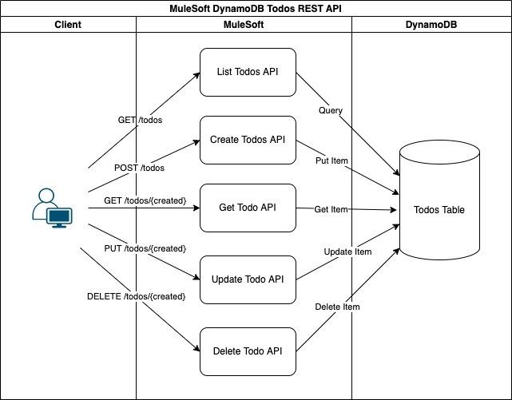

# MuleSoft DynamoDB Todos REST API

This is the sample source code repo for a thecodinginterface.com blog post [Todos REST API with MuleSoft and AWS DynamoDB](https://thecodinginterface.com/blog/mulesoft-dynamodb-todos-api/#implement-create-todo).

